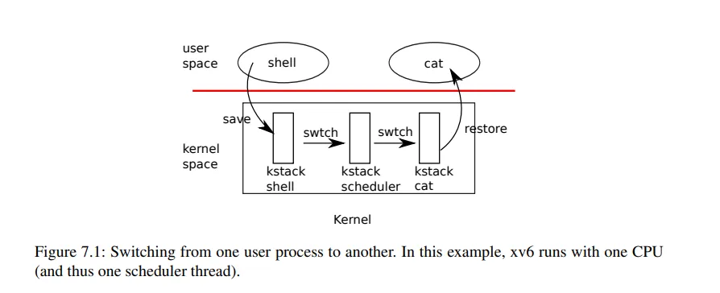

# Lec15：Crash Safety

`Crash Safety` 是文件系统操作过程中发生的突发故障后，系统 能够恢复到可用状态，数据可能会丢失，但是文件系统本身是完好的。

**常见的 Crash 场景**

* 运行 `make` 指令时，系统频繁读写文件，这时断电。
* 笔记本突然没电。
* 系统内核发生 panic（通常是内核 bug 导致）。

我们需要知道尽管磁盘是持久化存储设备，但问题在于：**文件系统操作往往涉及多个步骤**，如果在某个关键步骤时崩溃，就会留下不一致的状态。

我们采用的解决方法是 **logging。**

#### File System Case <a href="#jfp4l" id="jfp4l"></a>

<figure><figcaption></figcaption></figure>

如果我们发生 Crash 在第二次写入和**更新根目录的内容**：【 Block46】之间，也就是说我们在 【block33】表明了 inode 使用，但是没有放到任何目录中。这就会导致我们丢失了这个 inode,而且没办法删除。

**如果先更新目录再在 【block 33】标记 inode 使用能不能解决？**

在这个位置，目录被更新了，但是还没有在磁盘上分配inode。如果在这期间发生 crash 后重启，我们会读取一个未被分配的inode，因为inode在crash之前还未被标记成被分配。

更糟糕的是，如果inode之后被分配给一个不同的文件，这样会导致有两个应该完全不同的文件共享了同一个inode。如果这两个文件分别属于用户1和用户2，那么用户1就可以读到用户2的文件了。

***

我们再看另外一个例子

<figure><figcaption></figcaption></figure>

这里我们从bitmap block中分配了一个data block，但是又还没有更新到文件x的inode中。当我们重启之后，我们这里丢失了data block，因为这个data block被分配了，但是却没有出现在任何文件中，因为它还没有被记录在任何inode中。

我们这两个例子中有多个写磁盘操作，其实改变顺序没办法解决，哪怕第二个也是，这些操作必须是原子操作出现在磁盘上才能解决上述的问题。

#### File System Logging <a href="#ymz7x" id="ymz7x"></a>

Logging 有一些好的属性来解决这些问题：**atomic fs calls** 和 **fast recove**ry。

**Log 的基本工作方式**

我们来看看 log 的基本工作方式：

* （**log write**）每次操作首先会写入日志，记录的内容通常包括操作的类型、涉及的块、数据内容以及操作的顺序等。
* （**commit op**）当文件系统已经准备好将日志中记录的所有操作正式应用到磁盘上的数据结构中，就可以提交。在提交时，日志中会记录一个标识，表示这批操作的成功提交。通过记录操作数量，系统能够确保所有操作的执行顺序和完整性。
* **（install log）**&#x6B64;时，日志中的操作会被按顺序执行，数据从日志分区移到文件系统分区，实际的块数据（例如在block 45和block 33上的数据）会被写入到对应的磁盘位置。日志中的每个记录对应一个操作指令，操作指令会被直接应用到文件系统中的相应块。
* （**clean log**）当所有操作完成并且文件系统状态更新成功后，日志的清理就变得非常重要。清理日志的目的是释放空间并标记操作完成。通过将操作计数重置为0，文件系统可以确认所有已记录的操作都已经处理完毕。

**crash 重启**

假设我们 crash 重启，就可以根据 commit 记录值来操作，为 0 就什么也不做。如果大于0的话，我们就知道log中存储的block需要被写入到文件系统中，很明显我们在crash的时候并不一定完成了install log，我们可能是在commit之后，clean log之前crash的。所以这个时候我们需要做的就是reinstall（注，也就是将log中的block再次写入到文件系统），再clean log。

值得注意的是：恢复过程中不能执行文件系统的系统调用。这是因为在崩溃恢复期间，可能会涉及到将数据从日志移到文件系统的过程，而执行文件系统调用可能会破坏日志恢复过程的顺序或引发不一致。

**Reinstall 过程中会不会造成数据重复或者错误呢？**

在安装日志的恢复过程中，重复执行日志操作并不会造成数据重复或错误，因为每个操作都是在文件系统中写入固定的数据，数据的唯一性和一致性保证了即使多次写入，也不会产生副作用。

即便有重复操作，文件系统状态保持不变，也不会产生任何坏处。即使日志中的某些数据已经被写入文件系统，在后续的恢复过程中重复写入这些数据仍然是安全的。

**log 数据结构**

<figure><figcaption></figcaption></figure>

我们会有一个 header block，里面包含着：

* 数字n代表有效的log block的数量。
* 每个log block的实际对应的block编号

之后就是 log 的数据，也就是每个 block 的 Data 了。

当文件运行的时候，在内存中也有 hearder block 的一份拷贝。这里的 block 编号数组会将相应的 block 缓存在 block cache 中。比如： log中第一个block编号是45，那么在block cache的某个位置，也会有block 45的cache。

### Code: Crash Recovery <a href="#liigc" id="liigc"></a>

#### log\_write <a href="#pfgwo" id="pfgwo"></a>

以创建文件的sys\_open为例（在sysfile.c文件中）每个文件系统操作，都有begin\_op和end\_op分别表示事物的开始和结束。

<figure><figcaption></figcaption></figure>

在begin\_op和end\_op之间，磁盘上或者内存中的数据结构会更新。但是在end\_op之前，并不会有实际的改变（注，也就是不会写入到实际的block中）。在end\_op时，我们会将数据写入到log中，之后再写入commit record或者log header。

这里有趣的是，当文件系统调用执行写磁盘时会发生什么？

在 xv6 中， `ialloc()`->`log_write()`

l`og_write`是由文件系统的logging实现的方法。任何一个文件系统调用的`begin_op`和`end_op`之间的写操作总是会走到`log_write`。

```c
void
log_write(struct buf *b)
{
  int i;

  acquire(&log.lock);
  if (log.lh.n >= LOGSIZE || log.lh.n >= log.size - 1)
    panic("too big a transaction");
  if (log.outstanding < 1)
    panic("log_write outside of trans");

  for (i = 0; i < log.lh.n; i++) {
    if (log.lh.block[i] == b->blockno)   // log absorption
      break;
  }
  log.lh.block[i] = b->blockno;
  if (i == log.lh.n) {  // Add new block to log?
    bpin(b);
    log.lh.n++;
  }
  release(&log.lock);
}
```

我在执行 `log_write` 时，系统将数据块（如 【block 45】）首先写入到 **block cache** 中。这意味着在文件系统的操作中，`block 45` 已经被更新到内存中的缓存中，表示这个块的内容已经被修改。这部分数据暂时保留在内存中，等待在稍后的commit中写入磁盘（在这里并没有操作，等待 `end_op`函数 commit 再写入）。

首先代码会查看【block 45】是否已经被log记录了。如果是的话，其实不用做任何事情，因为block 45已经会被写入了。这种忽略的行为称为log absorbtion。如果block 45不在需要写入到磁盘中的block列表中，接下来会对n加1，并将block 45记录在列表的最后。之后，这里会通过调用`bpin`函数将【block 45】固定在block cache中。

#### end\_op 函数 <a href="#kspfy" id="kspfy"></a>

```c
// called at the end of each FS system call.
// commits if this was the last outstanding operation.
void
end_op(void)
{
  int do_commit = 0;

  acquire(&log.lock);
  log.outstanding -= 1;
  if(log.committing)
    panic("log.committing");
  if(log.outstanding == 0){
    do_commit = 1;
    log.committing = 1;
  } else {
    // begin_op() may be waiting for log space,
    // and decrementing log.outstanding has decreased
    // the amount of reserved space.
    wakeup(&log);
  }
  release(&log.lock);

  if(do_commit){
    // call commit w/o holding locks, since not allowed
    // to sleep with locks.
    commit();
    acquire(&log.lock);
    log.committing = 0;
    wakeup(&log);
    release(&log.lock);
  }
}
```

**Commit 函数**

```c
static void
commit()
{
  if (log.lh.n > 0) {
    write_log();     // Write modified blocks from cache to log
    write_head();    // Write header to disk -- the real commit
    install_trans(0); // Now install writes to home locations
    log.lh.n = 0;
    write_head();    // Erase the transaction from the log
  }
}
```

我们可以看到 `commit`函数主要是四个操作

* 首先是`write_log`。这基本上就是将所有存在于内存中的log header中的block编号对应的block，从block cache写入到磁盘上的log区域中（注，也就是将变化先从内存拷贝到log中）。
* `write_head`会将内存中的log header写入到磁盘中。
* `install_trans(0);`这是将 block 数据从 log 中拷贝到实际的文件系统 block 中。
* 最后就是清除 log 了

我们接下来对前三个操作追踪下看看发生了什么：

```c
// Copy modified blocks from cache to log.
static void
write_log(void)
{
  int tail;

  for (tail = 0; tail < log.lh.n; tail++) {
    struct buf *to = bread(log.dev, log.start+tail+1); // log block
    struct buf *from = bread(log.dev, log.lh.block[tail]); // cache block
    memmove(to->data, from->data, BSIZE);
    bwrite(to);  // write the log
    brelse(from);
    brelse(to);
  }
}
```

在 `write_log`函数中一次遍历 log 中的 block，写到 log 中。先读出 log block 再将 cache 中的 block 拷贝到 log block,最后将 log block 写回到磁盘中。接下来就是 `write_head`，这个函数被称为 **commit point。**

```c
// Write in-memory log header to disk.
// This is the true point at which the
// current transaction commits.
static void
write_head(void)
{
  struct buf *buf = bread(log.dev, log.start);
  struct logheader *hb = (struct logheader *) (buf->data);
  int i;
  hb->n = log.lh.n;
  for (i = 0; i < log.lh.n; i++) {
    hb->block[i] = log.lh.block[i];
  }
  bwrite(buf);
  brelse(buf);
}
```

这里首先读取 log 的 header block。将 n 拷贝到 block 中，将所有的 block 编号拷贝到 header 列表中。再将 header block 写回到磁盘。

**我们思考下：如果crash发生在这个`bwrite`之前或者之后，会发生什么？**

* 如果系统在 `bwrite` 之前崩溃，所有在内存中更新的数据（包括 `log header`）将不会被持久化到磁盘上。因此，日志中的事务并没有被真正提交，也没有更新文件系统。

在系统重启后，文件系统会扫描日志并检查已经提交的事务。如果系统崩溃发生在 `bwrite` 之前，则在恢复时 **不会看到该事务的提交记录**。因为日志 header 并没有写入磁盘，因此恢复程序不会看到这次事务的状态，也就不会执行相应的恢复操作。恢复程序只会执行那些已经在日志中成功提交并写入磁盘的事务。

* 如果系统在 `bwrite` 之后崩溃，意味着日志中的事务已经成功写入磁盘，即 **事务已经达到了 commit point**。因此，在文件系统恢复时，恢复程序可以按以下步骤恢复操作：
*
  * **读取 Log Header**：恢复程序会读取磁盘上的 `log header`，从中获取待恢复的事务信息，比如操作数量（`n`）和涉及的 block 列表。
  * **执行恢复操作**：恢复程序会发现事务已经记录在日志中且已写入磁盘，并且在日志中找到事务的操作。恢复程序接着会根据这些信息恢复文件系统操作，并将日志中的内容重新写入对应的块位置。也就是说，恢复程序会 **将未完成的事务**（例如，5个待写入的 log blocks）再次写入到实际的文件系统位置。

```c
// Copy committed blocks from log to their home location
static void
install_trans(int recovering)
{
    int tail;

    for (tail = 0; tail < log.lh.n; tail++) {
        struct buf *lbuf = bread(log.dev, log.start+tail+1); // read log block
        struct buf *dbuf = bread(log.dev, log.lh.block[tail]); // read dst
        memmove(dbuf->data, lbuf->data, BSIZE);  // copy block to dst
        bwrite(dbuf);  // write dst to disk
        if(recovering == 0)
            bunpin(dbuf);
        brelse(lbuf);
        brelse(dbuf);
    }
}
```

这里是先读取 log block,再读取文件系统中的 block.并将数据从 log 拷贝到文件系统中，实现将文件系统 block 落盘操作。即使这里 crash 也没关系，会重新执行遍也就是之前提到的 reinstall。

### File system recovering <a href="#vvuaz" id="vvuaz"></a>

接下来我们看一下发生在XV6的启动过程中的文件系统的恢复流程。当系统crash并重启了，在XV6启动过程中做的一件事情就是调用`initlog`函数。

```c
void
initlog(int dev, struct superblock *sb)
{
  if (sizeof(struct logheader) >= BSIZE)
    panic("initlog: too big logheader");

  initlock(&log.lock, "log");
  log.start = sb->logstart;
  log.size = sb->nlog;
  log.dev = dev;
  recover_from_log();
}
```

`initlog`基本上就是调用r`ecover_from_log`函数。

```c
static void
recover_from_log(void)
{
  read_head();
  install_trans(1); // if committed, copy from log to disk
  log.lh.n = 0;
  write_head(); // clear the log
}
```

`recover_from_log`先调用`read_head`函数从磁盘中读取`header`.

之后调用`install_trans`函数。这个函数之前在`commit`函数中也调用过，它就是读取`log header`中的`n`，然后根据n将所有的log block拷贝到文件系统的block中。`recover_from_log`在最后也会跟之前一样清除log。

### Log 写磁盘流程 <a href="#xcfga" id="xcfga"></a>

写磁盘操作
